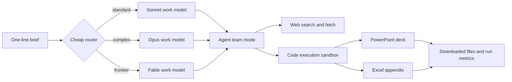

# Brief-to-Deck Agent

One-line brief in, client-ready PowerPoint deck plus Excel data appendix out.

```bash
python agent.py "competitive landscape for meal-kit delivery in India"
```

This repo is a small but complete autonomous analyst workflow. Give it a brief,
and it researches the market, checks sources, builds charts, creates a
consulting-style deck, writes a sourced Excel appendix, downloads the files, and
records timing, token, and cost metrics for the run.

**[Read the case study](docs/case-study.md)** — the measured workflow: manual
baseline, automation design decisions, run metrics, observed failure modes,
and the path to production.

The default workflow now uses **agent team mode**: a virtual pod of specialist
agents inside the same Claude tool loop. It is not a swarm of separate Python
processes or chat windows. It is a structured work mode that asks Claude to
divide the job into roles like research, verification, analysis, deck writing,
and QA before producing the final files.

## What It Builds

Each run is designed to produce:

- A 10-14 slide `.pptx` deck with insight-led headlines, charts, source-backed
  numbers, recommendations, risks, and a source slide.
- A `.xlsx` appendix with structured data tables and source columns.
- A `run_metrics.json` file with the selected model, agent mode, elapsed time,
  token usage, estimated cost, and generated filenames.

Outputs land in `outputs/<slugified-brief>/`.

## Agent Team Mode

By default, the work model runs with these internal specialist roles:

| Agent | Job |
|---|---|
| Research Lead | Turns the brief into a search plan and source map. |
| Source Verifier | Checks publication dates, source quality, conflicts, and citation traceability. |
| Market Analyst | Synthesizes competitors, segments, market dynamics, risks, and strategy. |
| Data Analyst | Builds tables, calculations, charts, and the Excel appendix. |
| Deck Architect | Designs the storyline and slide sequence. |
| Slide Writer | Turns analysis into crisp slide copy and insight-led headlines. |
| QA Reviewer | Checks files, consistency, citations, and obvious hallucination risks before finishing. |

Use direct mode when you want the original single-consultant behavior:

```bash
python agent.py "competitive landscape for meal-kit delivery in India" --agent-mode direct
```

## How It Works



The local script stays deliberately thin:

1. A cheap router call classifies the brief as `standard`, `complex`, or
   `frontier`.
2. The router selects the cheapest model tier expected to hit the quality bar.
3. The selected model runs with Anthropic server-side tools: web search, web
   fetch, and code execution.
4. The script resumes long tool loops when the API returns `pause_turn`, reusing
   the same sandbox container so generated files persist.
5. Generated `.pptx` and `.xlsx` files are downloaded locally.
6. `run_metrics.json` is written next to the deliverables.

## Quickstart

Prerequisites:

- Python 3.10+
- An Anthropic API key

```bash
git clone https://github.com/paramouxt/brief-to-deck-agent.git
cd brief-to-deck-agent
pip install -r requirements.txt

# Add your API key
cp .env.example .env
# Windows PowerShell:
# Copy-Item .env.example .env

python agent.py "competitive landscape for meal-kit delivery in India"
```

Useful options:

```bash
# Let the router pick the model and use the virtual specialist team
python agent.py "market entry strategy for premium matcha in the UK"

# Use the original single-consultant flow
python agent.py "market entry strategy for premium matcha in the UK" --agent-mode direct

# Force a model instead of routing automatically
python agent.py "AI infrastructure investment thesis for 2026" --model fable

# Save outputs somewhere specific
python agent.py "US creator economy payments landscape" --outdir outputs/creator-payments
```

## Example Output Folder

```text
outputs/competitive-landscape-for-meal-kit-delivery-in-india/
|-- meal-kit-india-deck.pptx
|-- meal-kit-india-data-appendix.xlsx
`-- run_metrics.json
```

Example metrics shape:

```json
{
  "brief": "competitive landscape for meal-kit delivery in India",
  "agent_mode": "team",
  "model": "claude-sonnet-4-6",
  "routing": {
    "model": "claude-sonnet-4-6",
    "complexity": "standard",
    "rationale": "Single-market descriptive landscape in a well-documented industry.",
    "router_cost_usd": 0.00081
  },
  "wall_clock_seconds": 1043.2,
  "api_turns": 4,
  "tokens": {
    "input": 41230,
    "output": 28114,
    "cache_read": 96400,
    "cache_write": 2210
  },
  "estimated_cost_usd": 0.59,
  "files": [
    "meal-kit-india-deck.pptx",
    "meal-kit-india-data-appendix.xlsx"
  ]
}
```

## Cost Awareness

The project is designed to avoid using the most expensive model by default.
A small router call chooses the work model:

| Tier | Model shorthand | Used for |
|---|---|---|
| standard | `sonnet` | Single-market landscapes and well-documented topics. |
| complex | `opus` | Multi-market briefs, deeper synthesis, sparse data, or forecasting. |
| frontier | `fable` | Ambiguous, novel, or high-reasoning strategy work. |

You can still force a model with `--model sonnet`, `--model opus`, or
`--model fable`.

## Repository Structure

```text
agent.py                    # routing, orchestration, streaming, downloads, metrics
prompts.py                  # router prompt, base spec, team mode, direct mode
requirements.txt            # Python dependencies
.env.example                # API key template
docs/case-study.md          # the case study: baseline, design, results, limitations
docs/case_study_template.md # blank framework for evaluating output quality
outputs/                    # generated deliverables, ignored by git
```

## Why This Is Useful

This is a practical portfolio project for learning how modern AI agents are
stitched together:

- Tool use: search, fetch, code execution, file generation.
- Orchestration: a local script controls model selection, streaming, retries,
  container reuse, downloads, and metrics.
- Prompt architecture: the product spec lives in prompts instead of scattered
  across code.
- Evaluation: each run produces artifacts and cost data that can be compared
  against a human analyst baseline.

## Honest Limitations

- Agent team mode is prompt-orchestrated inside one Claude run. It is not a
  distributed multi-agent system with independent workers.
- Live web sources can be incomplete or stale, especially when reports are
  paywalled.
- Citations improve traceability, but important numbers should still be
  spot-checked before client use.
- Deck design is functional. A branded template system would be a strong next
  feature.
- Running the agent uses the Anthropic API and may cost money.

## License

MIT
