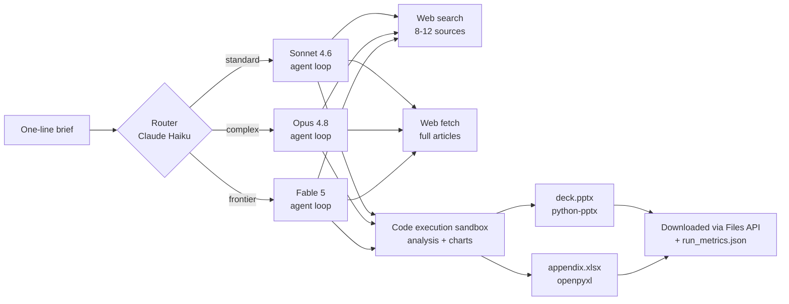

# Brief-to-Deck Agent

**One-line brief in → client-ready PowerPoint deck + Excel data appendix out. Fully autonomous.**

```
python agent.py "competitive landscape for meal-kit delivery in India"
```

~15–20 minutes later you have a 10–14 slide consulting-style deck with cited sources, charts, a competitor comparison matrix, and an Excel appendix where every data row carries its source — work that would take a junior analyst one to two days.

The agent is **cost-aware by design**: a cheap router call (Claude Haiku, fractions of a cent) first assesses how demanding the brief is, then routes the work to the cheapest Claude model that can still hit client-ready quality — **Sonnet 4.6** for standard briefs, **Opus 4.8** for complex ones, and **Claude Fable 5** (Anthropic's most capable model) only when frontier reasoning is the binding constraint. The work model then runs an autonomous loop with Anthropic server-side tools: live web search, full-text source fetching, and a sandboxed code environment where it analyzes the data, renders charts, and builds the actual `.pptx` / `.xlsx` files with `python-pptx` and `openpyxl` — no human in between.

## Why this project exists

Knowledge-work automation is mostly talked about in the abstract. This repo is a concrete, measurable example: it takes a real consulting workflow (brief → research → analysis → deliverable), automates it end-to-end, and instruments the run so you can put numbers on it — wall-clock time, token usage, and cost per deliverable are written to `run_metrics.json` on every run.

## How it works



The orchestration script (`agent.py`) is deliberately thin — about 250 lines. The heavy lifting happens server-side:

0. **Routing** — a Haiku call classifies the brief's complexity and selects the work model (cheapest tier that holds the quality bar).

1. **Research** — the model searches the web, fetches the most important sources in full, and tracks URLs + publication dates for the sources slide.
2. **Analysis** — in Anthropic's sandboxed code-execution container it builds comparison tables, computes market sizing, and renders charts with matplotlib.
3. **Document generation** — it writes the deck and appendix with `python-pptx` / `openpyxl` (pre-installed in the sandbox), then the script downloads the files via the Files API.
4. **Metrics** — every run logs duration, tokens, and estimated cost.

The "product spec" of the deliverable — deck structure, quality bar, citation rules — lives entirely in [`prompts.py`](prompts.py), so you can iterate on the output quality without touching pipeline code.

### Engineering notes

- **Adaptive model routing**: a Haiku classifier (with schema-enforced structured output) grades each brief as `standard` / `complex` / `frontier` and picks the cheapest capable model. Routing typically cuts cost 50–70% on standard briefs vs. always running the frontier model. The router's verdict and rationale are logged in `run_metrics.json`; if routing ever fails, the run falls back to Opus rather than blocking. Force a model with `--model sonnet|opus|fable`.
- **Long-horizon autonomy**: server-side tool loops pause every ~10 iterations (`stop_reason: "pause_turn"`); the script resumes automatically, reusing the same sandbox container so files persist across continuations.
- **Adaptive thinking + high effort**: `thinking: {type: "adaptive"}` with `effort: "high"` lets the model decide when to reason deeply (source synthesis) vs. act (writing slides).
- **Prompt caching**: the system prompt is cached, so continuations and repeat runs reread it at ~10% of input price.
- **Cost tracking**: usage is accumulated across all turns and priced per token class (input / output / cache read / cache write).

## Quickstart

**Prerequisites:** Python 3.10+, an [Anthropic API key](https://platform.claude.com/).

```bash
git clone https://github.com/paramouxt/brief-to-deck-agent.git
cd brief-to-deck-agent
pip install -r requirements.txt

# Add your API key
cp .env.example .env        # then edit .env
# (Windows PowerShell: Copy-Item .env.example .env)

# Run — the router picks the most cost-efficient model automatically
python agent.py "competitive landscape for meal-kit delivery in India"

# Or force a specific model
python agent.py "..." --model fable      # sonnet | opus | fable
```

Outputs land in `outputs/<slugified-brief>/`:

```
outputs/competitive-landscape-for-meal-kit-delivery-in-india/
├── meal-kit-india-deck.pptx          # the deck
├── meal-kit-india-data-appendix.xlsx # data appendix, sources per row
└── run_metrics.json                  # duration, tokens, cost
```

### Example `run_metrics.json`

```json
{
  "brief": "competitive landscape for meal-kit delivery in India",
  "model": "claude-sonnet-4-6",
  "routing": {
    "model": "claude-sonnet-4-6",
    "complexity": "standard",
    "rationale": "Single-market descriptive landscape in a well-documented industry.",
    "router_cost_usd": 0.00081
  },
  "wall_clock_seconds": 1043.2,
  "api_turns": 4,
  "tokens": { "input": 41230, "output": 28114, "cache_read": 96400, "cache_write": 2210 },
  "estimated_cost_usd": 0.59,
  "files": ["meal-kit-india-deck.pptx", "meal-kit-india-data-appendix.xlsx"]
}
```

## What a run costs

| Tier | Model | Pricing (per MTok in/out) | Typical run |
|---|---|---|---|
| standard | Sonnet 4.6 | $3 / $15 | $0.50–$1.20 |
| complex | Opus 4.8 | $5 / $25 | $0.80–$2.00 |
| frontier | Fable 5 | $10 / $50 | $1.50–$4.00 |

The router call itself costs fractions of a cent. Runs take 10–25 minutes depending on research depth. Compare to the manual baseline: ~8–16 analyst-hours for an equivalent first-draft deliverable.

## Evaluating output quality

For a rigorous comparison, use [`docs/case_study_template.md`](docs/case_study_template.md): run the agent on 3–5 briefs, have reviewers blind-rate the decks against human-made equivalents on accuracy, structure, and insight quality, and report the results. The template structures the full case study (problem → process → design → metrics → limitations).

## Repository structure

```
agent.py                       # orchestration: model routing, agent loop, streaming, file download, metrics
prompts.py                     # router prompt + the deliverable "spec" — deck structure, quality bar, citations
requirements.txt
.env.example
docs/case_study_template.md    # write-up template for quality evaluation
outputs/                       # generated deliverables (gitignored)
```

## Honest limitations

- Source quality is whatever live web search surfaces — paywalled industry reports are out of reach, so market-sizing numbers should be treated as directional.
- The model cites its sources, but citation ≠ verification; spot-check load-bearing numbers before client use.
- Deck visual design is functional, not branded. A template/theming pass is the natural next feature.

## License

MIT
